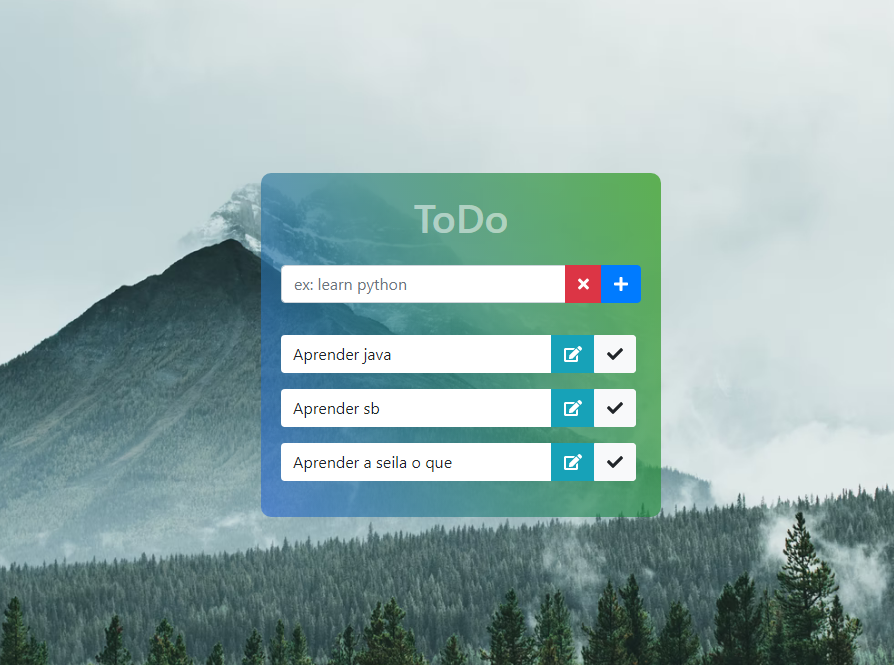

## Todo App - SpringBoot

### O que ele faz: 

Agendamento de tarefas...

### Screenshots

### O que usei:

#### No frontend

- Css
- Jquery
- Js
- Bootstrap

#### No backend

- Spring-boot
- Thymeleaf
- h2 database
- jpa

#### Tarefas concluidas:

- [x] Listar todos

- [x] Criar todos

- [x] Editar todos

- [x] Deletar todos

- [x] Exibir erros

#### Tarefas pendentes:

- [ ] novos erros

